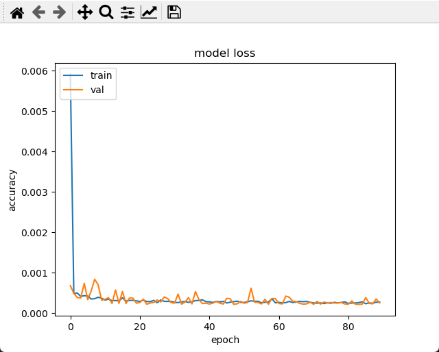

# Clean Currency Indexes

## Introduction
We are drowning in financial data. Every millisecond, new prices are created for thousands of foreign currencies, market securities, and many other financial instruments around the world.

To make things worse, currencies are traded in pairs - in effect, duplicating prices: for any set of _n_ currencies there are `nchoosek(n, 2)` currency pairs. With eight major currencies, some 70% of the information reflected by the currency pairs they generate, is redundant.

## Dimensionality Reduction
I have presented a visual demonstration of the difference between 28 currencies and eight, [explained](https://rpubs.com/Shahar/CurrencyIndexes) the process of dimensionality reduction, and demonstrated that no data is lost.

## Risk Reduction
I have also shown that this process reduces the risk (as measured by [volatility](https://rpubs.com/Shahar/ts)) while refining the signal "communicated" by the time series patterns.

The first part of the work (described above) was done primarily using R.

## Refined Signal / Reduced Noise
My hypothesis is that almost any model that predicts price using historical chart patterns, or algorithm that trades based on price action, could be improved by first reducing the dimensionality of the data. Of course, I cannot prove this general statement; however, here I demonstrate with an example.

## Data Acquisition and Wrangling
Forex data is available freely from numerous sources. For this project it was very important to use tick data: otherwise, OHLC (open, high, low, close) time series cannot be properly constructed for currencies, even if we only need lower frequencies.
The data was downloaded via Dukascopy's JForex platform (free when you sign up for a demo account). It was then "lined up" by data/time inside `pandas` dataframes ('create_ticks(year=2019)').
It was further manipulated (e.g. resampled) as needed, for example using `pd.p.resample(freq).ohlc()` (inside `create_ts(freq)`) before being used as input to the prediction models.

## Demonstration: Neural Network
We construct several `TensorFlow/Keras` neural networks, and compare their performance on traditional currency pairs, vs the synthetic currencies we extract.

All time series were split into training and test sets using `sklearn.model_selection.train_test_split`. They were then fed into a neural network with two `LSTM` layers, which are particularly suited for time series. The hyperparameters were optimized with `KerasTuner`.

## Distributed Computing
This project relies on 36 simultaneous neural networks: 28 for the currencies, and eight for the underlying currencies. To split the load among the processors and cores, the computations are executed asynchronously using `ThreadPoolExecutor` (in `distribute_predictions(prefix, suffix)`.

## Measuring Forecast Accuracy
There are many ways to compare the performance of various prediction models. I chose *Mean Absolute Percentage Error*, or MAPE, which is calculated as:
(Absolute Value(Actual – Forecast) / Actual) × 100

## Results
What we see is that if we compare the price prediction of these two sets, the latter performs much better. More important are the practical applications: for example, the if we divide the prediction of our EUR time series by the prediction of our USD time series, we usually get much closer to the actual market value, than does the prediction of the EUR/USD (without separating and reconstituting).
